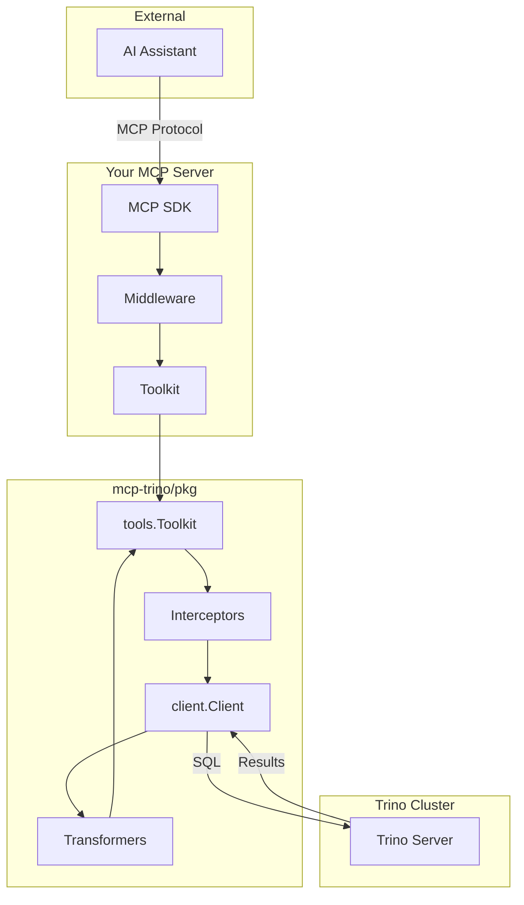
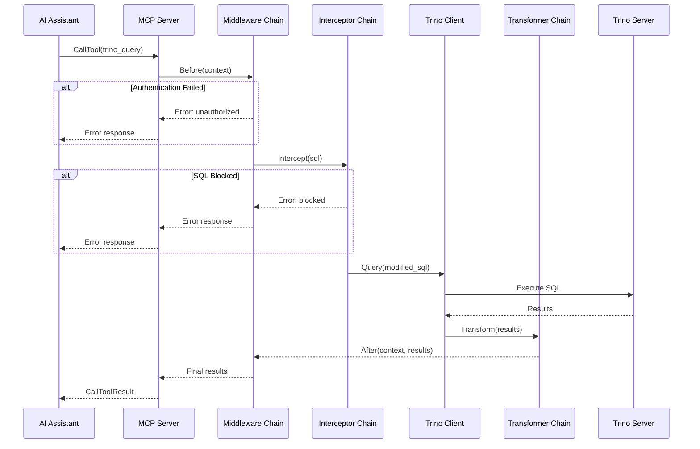
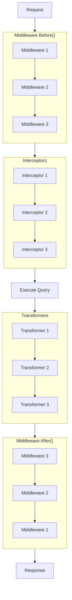
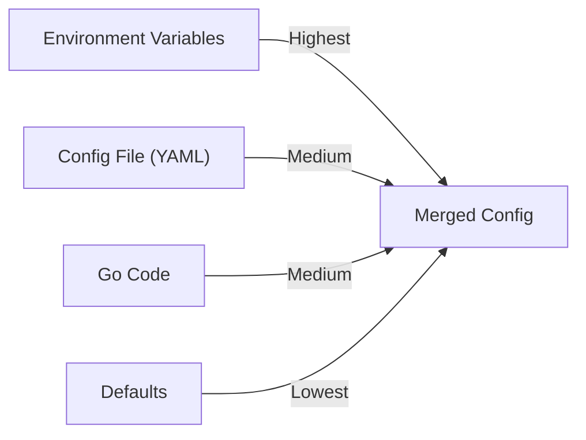

# Architecture

Understanding the mcp-trino package structure and request flow.

## Package Structure

| Package | Description |
|---------|-------------|
| `cmd/mcp-trino` | Standalone server entry point |
| `pkg/client` | Trino client wrapper (connection, queries, configuration) |
| `pkg/tools` | MCP tool implementations (toolkit, manager, query, explain, schema) |
| `pkg/extensions` | Built-in extensions (middleware, interceptors, transformers) |
| `internal/server` | Private default server setup |

## Component Diagram



## Request Flow



## Components

### Client (`pkg/client`)

The Trino client wrapper handles connection management and query execution.

```go
// Create from environment
cfg := client.FromEnv()
trinoClient, err := client.New(cfg)

// Or configure explicitly
cfg := client.Config{
    Host:     "trino.example.com",
    Port:     443,
    User:     "analyst",
    Password: "secret",
    Catalog:  "hive",
    SSL:      true,
}
trinoClient, err := client.New(cfg)
```

Key responsibilities:

- Connection pooling via `database/sql`
- DSN generation for Trino driver
- Query execution with context/timeout support
- Resource cleanup

### Toolkit (`pkg/tools`)

The toolkit manages MCP tool registration and coordinates extensions.

```go
toolkit := tools.NewToolkit(trinoClient, tools.Config{
    DefaultLimit:   1000,
    MaxLimit:       10000,
    DefaultTimeout: 120 * time.Second,
    MaxTimeout:     300 * time.Second,
})

// Add extensions
toolkit.Use(middleware)
toolkit.AddInterceptor(interceptor)
toolkit.AddTransformer(transformer)

// Register tools on MCP server
toolkit.RegisterAll(mcpServer)
```

Key responsibilities:

- Tool registration with MCP server
- Extension chain management
- Configuration enforcement (limits, timeouts)
- Multi-server connection management

### Manager (`pkg/tools`)

Manages multiple Trino connections for multi-cluster deployments.

```go
manager := tools.NewManager()
manager.Add("prod", prodClient)
manager.Add("staging", stagingClient)
manager.SetDefault("prod")

toolkit := tools.NewToolkitWithManager(manager, cfg)
```

### Extensions (`pkg/extensions`)

Built-in extensions for common use cases:

| Extension | Type | Purpose |
|-----------|------|---------|
| `LoggingMiddleware` | Middleware | Request/response logging |
| `ReadOnlyMiddleware` | Middleware | Block write operations |
| `MetricsMiddleware` | Middleware | Collect metrics |
| `QueryLogInterceptor` | Interceptor | SQL audit logging |
| `MetadataTransformer` | Transformer | Add execution metadata |
| `ErrorHelpTransformer` | Transformer | Enhance error messages |

## Extension Execution Order

Extensions are executed in a specific order:



Note: Middleware `After()` is called in reverse order (LIFO).

## Tool Registration

The toolkit registers these MCP tools:

| Tool | Method | Description |
|------|--------|-------------|
| `trino_query` | `RegisterQuery` | Execute SQL queries |
| `trino_explain` | `RegisterExplain` | Analyze query plans |
| `trino_list_catalogs` | `RegisterListCatalogs` | List catalogs |
| `trino_list_schemas` | `RegisterListSchemas` | List schemas |
| `trino_list_tables` | `RegisterListTables` | List tables |
| `trino_describe_table` | `RegisterDescribeTable` | Describe table |
| `trino_list_connections` | `RegisterListConnections` | List connections |

Register all at once:

```go
toolkit.RegisterAll(mcpServer)
```

Or selectively:

```go
toolkit.RegisterQuery(mcpServer)
toolkit.RegisterExplain(mcpServer)
// Skip others
```

## Configuration Flow

Configuration sources (in priority order):



Example:

```go
// Defaults
cfg := tools.DefaultConfig()

// Override in code
cfg.MaxLimit = 5000

// File config overrides code
serverCfg, _ := extensions.FromFile("config.yaml")

// Environment overrides everything
// TRINO_HOST, TRINO_USER, etc.
```

## Thread Safety

All components are thread-safe:

- **Client**: Uses `database/sql` connection pool
- **Toolkit**: Thread-safe tool execution
- **ToolContext**: Uses `sync.Map` for values
- **Manager**: Thread-safe connection lookup

## Next Steps

- [Extensibility](extensibility.md) - Build custom middleware, interceptors, and transformers
