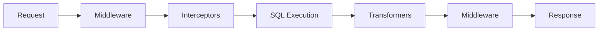

# Extensibility

mcp-trino provides three extension points for customizing behavior: middleware, interceptors, and transformers.

## Overview

| Extension Type | When | Purpose |
|---------------|------|---------|
| **Middleware** | Before/after tool execution | Authentication, logging, rate limiting |
| **Interceptors** | Before SQL execution | Query validation, rewriting, audit |
| **Transformers** | After query execution | Result modification, redaction, enrichment |



---

## Middleware

Middleware intercepts tool calls before and after execution.

### Interface

```go
type ToolMiddleware interface {
    Before(ctx *ToolContext) error
    After(ctx *ToolContext, result *mcp.CallToolResult, err error)
}
```

### ToolContext

The context carries request information through the chain:

```go
type ToolContext struct {
    ToolName   string
    Arguments  map[string]interface{}
    StartTime  time.Time
    RequestID  string
    values     sync.Map
}

// Store and retrieve custom values
ctx.Set("user_id", userID)
userID, ok := ctx.Get("user_id")
```

### Example: Authentication

```go
type AuthMiddleware struct {
    validator TokenValidator
}

func (m *AuthMiddleware) Before(ctx *ToolContext) error {
    token, ok := ctx.Get("auth_token")
    if !ok {
        return errors.New("authentication required")
    }

    user, err := m.validator.Validate(token.(string))
    if err != nil {
        return fmt.Errorf("invalid token: %w", err)
    }

    ctx.Set("user", user)
    return nil
}

func (m *AuthMiddleware) After(ctx *ToolContext, result *mcp.CallToolResult, err error) {
    user, _ := ctx.Get("user")
    log.Printf("User %s accessed %s", user, ctx.ToolName)
}
```

### Example: Rate Limiting

```go
type RateLimitMiddleware struct {
    limiter *rate.Limiter
}

func NewRateLimitMiddleware(rps float64, burst int) *RateLimitMiddleware {
    return &RateLimitMiddleware{
        limiter: rate.NewLimiter(rate.Limit(rps), burst),
    }
}

func (m *RateLimitMiddleware) Before(ctx *ToolContext) error {
    if !m.limiter.Allow() {
        return errors.New("rate limit exceeded")
    }
    return nil
}

func (m *RateLimitMiddleware) After(ctx *ToolContext, result *mcp.CallToolResult, err error) {}
```

### Example: Request Logging

```go
type RequestLogMiddleware struct {
    output io.Writer
}

func (m *RequestLogMiddleware) Before(ctx *ToolContext) error {
    json.NewEncoder(m.output).Encode(map[string]interface{}{
        "event":      "request_start",
        "request_id": ctx.RequestID,
        "tool":       ctx.ToolName,
        "timestamp":  ctx.StartTime.Format(time.RFC3339),
    })
    return nil
}

func (m *RequestLogMiddleware) After(ctx *ToolContext, result *mcp.CallToolResult, err error) {
    status := "success"
    if err != nil {
        status = "error"
    }
    json.NewEncoder(m.output).Encode(map[string]interface{}{
        "event":       "request_end",
        "request_id":  ctx.RequestID,
        "tool":        ctx.ToolName,
        "status":      status,
        "duration_ms": time.Since(ctx.StartTime).Milliseconds(),
    })
}
```

### Middleware Chain

Middleware executes in order added. `After()` runs in reverse:

```go
toolkit.Use(loggingMiddleware)    // 1st Before, Last After
toolkit.Use(authMiddleware)       // 2nd Before, 2nd-to-last After
toolkit.Use(rateLimitMiddleware)  // 3rd Before, 3rd-to-last After
```

If `Before()` returns an error, the chain stops and the tool doesn't execute.

---

## Interceptors

Interceptors transform SQL before execution.

### Interface

```go
type QueryInterceptor interface {
    Intercept(ctx context.Context, sql string) (string, error)
}
```

### Example: SQL Validation

```go
type SQLValidatorInterceptor struct {
    blockedPatterns []*regexp.Regexp
}

func NewSQLValidatorInterceptor(patterns []string) *SQLValidatorInterceptor {
    compiled := make([]*regexp.Regexp, len(patterns))
    for i, p := range patterns {
        compiled[i] = regexp.MustCompile(p)
    }
    return &SQLValidatorInterceptor{blockedPatterns: compiled}
}

func (i *SQLValidatorInterceptor) Intercept(ctx context.Context, sql string) (string, error) {
    normalized := strings.ToUpper(sql)
    for _, pattern := range i.blockedPatterns {
        if pattern.MatchString(normalized) {
            return "", fmt.Errorf("SQL pattern blocked by security policy")
        }
    }
    return sql, nil
}
```

### Example: Tenant Filter

```go
type TenantFilterInterceptor struct {
    column string
}

func (i *TenantFilterInterceptor) Intercept(ctx context.Context, sql string) (string, error) {
    tenant := ctx.Value("tenant")
    if tenant == nil {
        return "", errors.New("tenant not found in context")
    }

    // Wrap query with tenant filter
    return fmt.Sprintf(
        "SELECT * FROM (%s) WHERE %s = '%s'",
        sql, i.column, tenant,
    ), nil
}
```

### Example: Audit Logging

```go
type AuditLogInterceptor struct {
    output io.Writer
}

func (i *AuditLogInterceptor) Intercept(ctx context.Context, sql string) (string, error) {
    json.NewEncoder(i.output).Encode(map[string]interface{}{
        "timestamp": time.Now().Format(time.RFC3339),
        "event":     "query_executed",
        "sql":       sql,
        "user":      ctx.Value("user"),
    })
    return sql, nil // Pass through unchanged
}
```

### Example: Schema Rewriting

```go
type SchemaRewriteInterceptor struct {
    from, to string
}

func (i *SchemaRewriteInterceptor) Intercept(ctx context.Context, sql string) (string, error) {
    pattern := regexp.MustCompile(`\b` + i.from + `\.`)
    return pattern.ReplaceAllString(sql, i.to+"."), nil
}
```

### Interceptor Chain

Each interceptor receives the output of the previous one:

```go
toolkit.AddInterceptor(auditInterceptor)      // 1st - logs original
toolkit.AddInterceptor(validatorInterceptor)  // 2nd - validates
toolkit.AddInterceptor(rewriteInterceptor)    // 3rd - rewrites
```

Return an error to block execution.

---

## Transformers

Transformers modify query results before returning to the client.

### Interface

```go
type ResultTransformer interface {
    Transform(ctx context.Context, result *QueryResult) (*QueryResult, error)
}

type QueryResult struct {
    Columns  []string
    Rows     [][]interface{}
    RowCount int
    Metadata map[string]interface{}
}
```

### Example: Data Redaction

```go
type RedactionTransformer struct {
    sensitiveColumns map[string]bool
    redactedValue    string
}

func NewRedactionTransformer(columns []string) *RedactionTransformer {
    sensitive := make(map[string]bool)
    for _, col := range columns {
        sensitive[strings.ToLower(col)] = true
    }
    return &RedactionTransformer{
        sensitiveColumns: sensitive,
        redactedValue:    "***REDACTED***",
    }
}

func (t *RedactionTransformer) Transform(ctx context.Context, result *QueryResult) (*QueryResult, error) {
    // Find sensitive column indices
    sensitiveIndices := make(map[int]bool)
    for i, col := range result.Columns {
        if t.sensitiveColumns[strings.ToLower(col)] {
            sensitiveIndices[i] = true
        }
    }

    // Redact values
    for _, row := range result.Rows {
        for i := range row {
            if sensitiveIndices[i] {
                row[i] = t.redactedValue
            }
        }
    }

    return result, nil
}
```

### Example: Metadata Enrichment

```go
type MetadataTransformer struct{}

func (t *MetadataTransformer) Transform(ctx context.Context, result *QueryResult) (*QueryResult, error) {
    if result.Metadata == nil {
        result.Metadata = make(map[string]interface{})
    }

    result.Metadata["row_count"] = result.RowCount
    result.Metadata["column_count"] = len(result.Columns)
    result.Metadata["timestamp"] = time.Now().Format(time.RFC3339)

    return result, nil
}
```

### Example: Date Formatting

```go
type DateFormatTransformer struct {
    outputFormat string
    dateColumns  map[string]bool
}

func (t *DateFormatTransformer) Transform(ctx context.Context, result *QueryResult) (*QueryResult, error) {
    dateIndices := make(map[int]bool)
    for i, col := range result.Columns {
        if t.dateColumns[strings.ToLower(col)] {
            dateIndices[i] = true
        }
    }

    for _, row := range result.Rows {
        for i := range row {
            if dateIndices[i] {
                if ts, ok := row[i].(time.Time); ok {
                    row[i] = ts.Format(t.outputFormat)
                }
            }
        }
    }

    return result, nil
}
```

### Transformer Chain

Each transformer receives the output of the previous one:

```go
toolkit.AddTransformer(redactionTransformer)   // 1st - redact sensitive
toolkit.AddTransformer(dateFormatTransformer)  // 2nd - format dates
toolkit.AddTransformer(metadataTransformer)    // 3rd - add metadata
```

---

## Semantic Providers

Add organizational context to tool output by integrating with metadata catalogs.

```go
import (
    "github.com/txn2/mcp-trino/pkg/semantic"
    "github.com/txn2/mcp-trino/pkg/semantic/providers/datahub"
    "github.com/txn2/mcp-trino/pkg/tools"
)

// Create DataHub provider
provider, _ := datahub.New(datahub.FromEnv())
defer provider.Close()

// Add to toolkit with caching
toolkit := tools.NewToolkit(trinoClient, cfg,
    tools.WithSemanticProvider(provider),
    tools.WithSemanticCache(semantic.DefaultCacheConfig()),
)
```

When configured, `trino_describe_table` enriches output with:

- Table and column descriptions
- Ownership information
- Tags and domain classifications
- Sensitivity markers (PII, sensitive data)
- Deprecation warnings

See the [Semantic Layer documentation](../semantic/index.md) for provider setup, caching, and building custom providers.

---

## Tool Descriptions

Override the description that AI agents see for each tool. Useful for adding domain-specific context so the agent understands what data is behind each tool.

### Toolkit-Level Overrides

Set descriptions for multiple tools at construction time with `WithDescriptions`:

```go
toolkit := tools.NewToolkit(trinoClient, cfg,
    tools.WithDescriptions(map[tools.ToolName]string{
        tools.ToolQuery:         "Query the retail analytics warehouse",
        tools.ToolDescribeTable: "Describe tables in the retail warehouse",
    }),
)
toolkit.RegisterAll(server)
```

### Per-Registration Overrides

Set a description for a single tool at registration time with `WithDescription` via `RegisterWith`:

```go
toolkit.RegisterWith(server, tools.ToolQuery,
    tools.WithDescription("Query the retail analytics warehouse"),
)
```

### Priority Chain

When multiple sources provide a description, the highest-priority source wins:

```
per-registration (WithDescription)
        ↓ fallback
toolkit-level (WithDescriptions)
        ↓ fallback
file config (toolkit.descriptions)
        ↓ fallback
built-in default
```

Use `tools.DefaultDescription(tools.ToolQuery)` to read the built-in default for any tool.

---

## Tool Annotations

Declare behavioral hints on tools so that AI agents understand side effects without executing them. Annotations follow the [MCP specification](https://spec.modelcontextprotocol.io/) and include `readOnlyHint`, `destructiveHint`, `idempotentHint`, and `openWorldHint`.

All built-in tools ship with sensible default annotations. Schema-browsing tools are marked read-only and idempotent; `trino_query` is marked non-destructive but not read-only (since the SQL could be anything).

### Default Annotations

| Tool | ReadOnly | Destructive | Idempotent | OpenWorld |
|------|----------|-------------|------------|-----------|
| `trino_query` | false | **false** | false | false |
| `trino_explain` | true | — | true | false |
| `trino_list_catalogs` | true | — | true | false |
| `trino_list_schemas` | true | — | true | false |
| `trino_list_tables` | true | — | true | false |
| `trino_describe_table` | true | — | true | false |
| `trino_list_connections` | true | — | true | false |

Read the built-in default for any tool:

```go
ann := tools.DefaultAnnotations(tools.ToolQuery)
// ann.DestructiveHint => *false
```

### Toolkit-Level Overrides

Set annotations for multiple tools at construction time with `WithAnnotations`:

```go
toolkit := tools.NewToolkit(trinoClient, cfg,
    tools.WithAnnotations(map[tools.ToolName]*mcp.ToolAnnotations{
        tools.ToolQuery: {
            ReadOnlyHint:   true,  // e.g., if a read-only interceptor is active
            IdempotentHint: true,
        },
    }),
)
toolkit.RegisterAll(server)
```

### Per-Registration Overrides

Set annotations for a single tool at registration time with `WithAnnotation` via `RegisterWith`:

```go
toolkit.RegisterWith(server, tools.ToolQuery,
    tools.WithAnnotation(&mcp.ToolAnnotations{
        ReadOnlyHint:   true,
        IdempotentHint: true,
    }),
)
```

### Priority Chain

When multiple sources provide annotations, the highest-priority source wins:

```
per-registration (WithAnnotation)
        ↓ fallback
toolkit-level (WithAnnotations)
        ↓ fallback
built-in default
```

---

## Structured Outputs

All tool handlers return typed output structs alongside the human-readable `TextContent` result. This enables downstream consumers (middleware, platform wrappers, programmatic clients) to access structured data without parsing text.

### Output Types

| Tool | Output Type | Key Fields |
|------|------------|------------|
| `trino_query` | `QueryOutput` | `columns`, `rows`, `row_count`, `stats` |
| `trino_explain` | `ExplainOutput` | `plan`, `type` |
| `trino_list_catalogs` | `ListCatalogsOutput` | `catalogs`, `count` |
| `trino_list_schemas` | `ListSchemasOutput` | `catalog`, `schemas`, `count` |
| `trino_list_tables` | `ListTablesOutput` | `catalog`, `schema`, `tables`, `count`, `pattern` |
| `trino_describe_table` | `DescribeTableOutput` | `catalog`, `schema`, `table`, `columns`, `column_count` |
| `trino_list_connections` | `ListConnectionsOutput` | `connections`, `count` |

### Accessing Structured Output

Tool handlers return `(*mcp.CallToolResult, *OutputType, error)`. The second return value carries the structured output:

```go
// In middleware or a wrapping handler, the typed output is available
// as the second return value from the handler function.
//
// Example: QueryOutput
// {
//   "columns": [{"name": "id", "type": "bigint"}, ...],
//   "rows": [{"id": 1, "name": "alice"}, ...],
//   "row_count": 2,
//   "stats": {"row_count": 2, "truncated": false, "duration_ms": 42}
// }
```

---

## Built-in Extensions

mcp-trino includes ready-to-use extensions:

```go
import "github.com/txn2/mcp-trino/pkg/extensions"

// Middleware
toolkit.Use(extensions.NewLoggingMiddleware(os.Stderr))
toolkit.Use(extensions.NewReadOnlyMiddleware())
toolkit.Use(extensions.NewMetricsMiddleware(collector))

// Interceptors
toolkit.AddInterceptor(extensions.NewQueryLogInterceptor(os.Stderr))
toolkit.AddInterceptor(extensions.NewReadOnlyInterceptor())

// Transformers
toolkit.AddTransformer(extensions.NewMetadataTransformer())
toolkit.AddTransformer(extensions.NewErrorHelpTransformer())
```

---

## Complete Example

Production server with all extension types:

```go
package main

import (
    "log"
    "os"

    "github.com/modelcontextprotocol/go-sdk/server"

    "github.com/txn2/mcp-trino/pkg/client"
    "github.com/txn2/mcp-trino/pkg/extensions"
    "github.com/txn2/mcp-trino/pkg/tools"
)

func main() {
    trinoClient, _ := client.New(client.FromEnv())
    defer trinoClient.Close()

    toolkit := tools.NewToolkit(trinoClient, tools.DefaultConfig())

    // Middleware: auth, logging, rate limiting
    toolkit.Use(&AuthMiddleware{validator: tokenValidator})
    toolkit.Use(extensions.NewLoggingMiddleware(os.Stderr))
    toolkit.Use(&RateLimitMiddleware{limiter: rateLimiter})
    toolkit.Use(extensions.NewReadOnlyMiddleware())

    // Interceptors: audit, validation, tenant filter
    toolkit.AddInterceptor(&AuditLogInterceptor{output: auditFile})
    toolkit.AddInterceptor(NewSQLValidatorInterceptor(blockedPatterns))
    toolkit.AddInterceptor(&TenantFilterInterceptor{column: "tenant_id"})

    // Transformers: redaction, metadata
    toolkit.AddTransformer(NewRedactionTransformer([]string{"ssn", "credit_card"}))
    toolkit.AddTransformer(extensions.NewMetadataTransformer())

    mcpServer := server.NewMCPServer("enterprise-server", "1.0.0")
    toolkit.RegisterAll(mcpServer)

    if err := server.ServeStdio(mcpServer); err != nil {
        log.Fatal(err)
    }
}
```

---

## Testing Extensions

### Testing Middleware

```go
func TestAuthMiddleware(t *testing.T) {
    mw := &AuthMiddleware{validator: mockValidator}

    ctx := &ToolContext{}
    ctx.Set("auth_token", "valid-token")

    err := mw.Before(ctx)
    assert.NoError(t, err)

    user, ok := ctx.Get("user")
    assert.True(t, ok)
    assert.Equal(t, "test-user", user)
}
```

### Testing Interceptors

```go
func TestSQLValidator(t *testing.T) {
    interceptor := NewSQLValidatorInterceptor([]string{`DROP\s+TABLE`})

    tests := []struct {
        sql     string
        wantErr bool
    }{
        {"SELECT * FROM users", false},
        {"DROP TABLE users", true},
    }

    for _, tt := range tests {
        _, err := interceptor.Intercept(context.Background(), tt.sql)
        if tt.wantErr {
            assert.Error(t, err)
        } else {
            assert.NoError(t, err)
        }
    }
}
```

### Testing Transformers

```go
func TestRedactionTransformer(t *testing.T) {
    transformer := NewRedactionTransformer([]string{"password"})

    result := &QueryResult{
        Columns: []string{"id", "name", "password"},
        Rows: [][]interface{}{
            {1, "Alice", "secret123"},
        },
    }

    transformed, err := transformer.Transform(context.Background(), result)
    assert.NoError(t, err)
    assert.Equal(t, "***REDACTED***", transformed.Rows[0][2])
}
```
