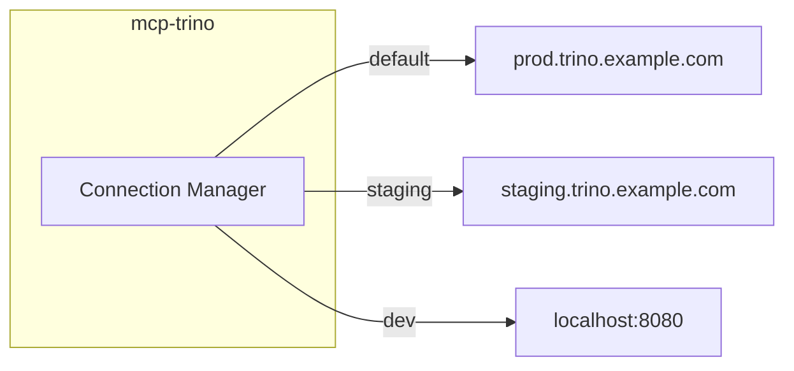

# Multi-Server

Connect to multiple Trino clusters from a single mcp-trino installation.

## Use Cases

- **Environment Separation** - Query production, staging, and development
- **Data Federation** - Access data across multiple clusters
- **Disaster Recovery** - Failover between primary and secondary

## Configuration

### Primary Server

Configure with standard environment variables:

```bash
export TRINO_HOST=prod.trino.example.com
export TRINO_USER=analyst
export TRINO_PASSWORD=secret
export TRINO_CATALOG=hive
```

### Additional Servers

Add more servers with `TRINO_ADDITIONAL_SERVERS`:

```bash
export TRINO_ADDITIONAL_SERVERS='{
  "staging": {
    "host": "staging.trino.example.com"
  },
  "dev": {
    "host": "localhost",
    "port": 8080,
    "ssl": false
  }
}'
```

### Server Configuration Fields

| Field | Required | Description |
|-------|----------|-------------|
| `host` | Yes | Trino server hostname |
| `port` | No | Server port (default: 443/8080) |
| `user` | No | Username (inherits from primary) |
| `password` | No | Password (inherits from primary) |
| `catalog` | No | Default catalog |
| `schema` | No | Default schema |
| `ssl` | No | Enable HTTPS |

### Credential Inheritance

Additional servers inherit credentials from the primary server unless overridden:

```bash
# Primary credentials
export TRINO_USER=analyst
export TRINO_PASSWORD=secret

# Staging inherits credentials
export TRINO_ADDITIONAL_SERVERS='{
  "staging": {
    "host": "staging.trino.example.com"
  }
}'
```

To use different credentials:

```bash
export TRINO_ADDITIONAL_SERVERS='{
  "dev": {
    "host": "localhost",
    "port": 8080,
    "user": "admin",
    "password": "",
    "ssl": false
  }
}'
```

## Usage

### Connection Parameter

All tools accept an optional `connection` parameter:

> "Query the staging server: SELECT COUNT(*) FROM users"

The AI assistant uses `connection: "staging"`.

### List Connections

Use `trino_list_connections` to see available servers:

> "What Trino servers are configured?"

Response:
```json
{
  "connections": [
    {"name": "default", "host": "prod.trino.example.com"},
    {"name": "staging", "host": "staging.trino.example.com"},
    {"name": "dev", "host": "localhost"}
  ],
  "default": "default"
}
```

### Natural Language Examples

| Prompt | Connection Used |
|--------|-----------------|
| "Query the staging server" | `staging` |
| "Run this on dev" | `dev` |
| "Compare users between prod and staging" | Both connections |
| "Show me the schema" | `default` (primary) |

## Architecture



## Best Practices

### Naming

Use clear, consistent names:

```bash
# Good
"production", "staging", "development"
"us-east", "us-west", "eu-central"

# Avoid
"server1", "server2"
"trino-new", "trino-old"
```

### Security

Use separate credentials per environment when possible:

```yaml
# config.yaml
additional_servers:
  production:
    host: prod.trino.example.com
    user: ${PROD_TRINO_USER}
    password: ${PROD_TRINO_PASSWORD}
  staging:
    host: staging.trino.example.com
    user: ${STAGING_TRINO_USER}
    password: ${STAGING_TRINO_PASSWORD}
```

### Default Connection

Set the safest connection as default (usually development or read-only replica).

## Error Handling

### Unknown Connection

```
Error: Connection 'invalid' not found
Available: default, staging, dev
```

### Connection Failed

```
Error: Failed to connect to 'staging': connection refused
Check that the server is running and accessible.
```

## Next Steps

- [Configuration Reference](../reference/configuration.md) - All configuration options
- [Security](../reference/security.md) - Security considerations
